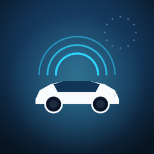

# VW Group EU Data Act for Home Assistant

<p align="center">
  
</p>

[](https://github.com/TommiG1/HA_VAG-EU-Data-Act/actions/workflows/test.yml)
[](https://community.home-assistant.io/t/beta-vw-group-eu-data-act-vehicle-data-for-vw-audi-skoda-seat-cupra-bentley-official-portal/1013514)
[](https://www.paypal.com/paypalme/tommigraf)

A Home Assistant custom integration that reads vehicle data from the official
[Volkswagen Group EU Data Act portal](https://eu-data-act.drivesomethinggreater.com/).

Supports **all major VAG brands** on the portal: Volkswagen, Audi, Škoda, SEAT,
Cupra, Bentley, and Volkswagen Commercial Vehicles.

After VW restricted unofficial third-party API access in 2026, this integration
provides a **legal, read-only** alternative using the portal intended for vehicle
owners under the EU Data Act.

> **Beta** — see [TESTING.md](TESTING.md) if you want to help test your brand.
> See [RELEASE_NOTES.md](RELEASE_NOTES.md) for version history.

> **Not a replacement for WeConnect integrations:** no climate control, no
> charging commands, no real-time polling. Data updates roughly every 15 minutes.

## Supported brands

| Home Assistant | Brand slug (`test_login.py`) |
|----------------|------------------------------|
| Volkswagen | `volkswagen` |
| Volkswagen Commercial Vehicles | `volkswagen_commercial` |
| Audi | `audi` |
| Škoda | `skoda` |
| SEAT | `seat` |
| Cupra | `cupra` |
| Bentley | `bentley` |

Use the brand that matches your account credentials (VW ID, myAudi, Cupra ID, etc.).

## Requirements

- Home Assistant **2024.12.0** or newer
- Account for your brand on the EU Data Act portal (VW ID, Cupra ID, myAudi, etc.)
- You must be the **Primary User** of the vehicle on that account
- Active **continuous 15-minute** data request on the portal (free; renew on the portal about every 12 months)

## FAQ

### Do I need VW Connect Plus (paid app subscription)?

**No.** VW Connect Plus is a separate paid package for remote app features (climate,
charge control, etc.) — not for the EU Data Act portal. The [official portal
FAQ](https://eu-data-act.drivesomethinggreater.com/pl/en/service/faq.html) states
that access to your vehicle data is **free of charge** under the EU Data Act; you
only need a Volkswagen Group brand account linked to the vehicle.

Do not confuse that with the portal’s own **continuous data request** (the
15-minute “subscription” you create under Data clusters). That is free and is
what this integration downloads — it is unrelated to Connect Plus.

### Does the car need to be online?

**Yes.** The portal only delivers what the vehicle uploads. If you only receive
`_no_content_found` ZIPs, wake the car (drive, ignition on, or open the mobile
app). Whether telemetry still flows after all manufacturer connectivity packages
(basic Connect, trial, Connect Plus) have expired is not fully documented; if you
get real data without Connect Plus, please share your model in the
[community thread](https://community.home-assistant.io/t/beta-vw-group-eu-data-act-vehicle-data-for-vw-audi-skoda-seat-cupra-bentley-official-portal/1013514)
— it helps other owners.

### Setup fails or no data yet?

**Complete portal setup before Home Assistant.** The integration only downloads
ZIP files from an **already active** continuous 15-minute subscription — it
cannot create or fix portal requests.

If setup shows *Could not connect to the EU Data Act portal* **after** login and
vehicle selection, your credentials are usually fine. The error often means the
portal has no **Identifier** yet for an active continuous request on that VIN
(onboarding not finished, or the portal backend is having problems).

On the portal, confirm:

1. The vehicle is linked under **Data clusters → Vehicle overview**.
2. A **continuous** (not one-time) **15-minute** request is active with **All
   Data**.
3. Real ZIP files appear for the VIN — first delivery can take **15–60 minutes,
   sometimes several hours** after creating the request.
4. Only **one** customised data request can be active at a time ([portal
   FAQ](https://eu-data-act.drivesomethinggreater.com/pl/en/service/faq.html)).
   A pending **one-time export** blocks a new continuous request until it
   finishes (up to 24 hours). The portal often has no cancel button — wait or
   contact **portal support** via the Contact section.

Then add the integration again (or remove and re-add). If the portal UI itself
shows errors such as *We couldn't transmit your request*, that is a **portal-side
problem** — not something this integration can bypass.

After a portal outage, some fields may show stale values until the car uploads
fresh telemetry again (often after one drive).

### Disabled diagnostic sensors?

Some entities are **raw portal fields**, disabled by default. Ignore them unless
you are debugging — use the curated sensors (Battery, range, charge state, etc.)
instead.

## Portal setup (required)

**Do this first**, before adding the integration in Home Assistant:

1. Open [eu-data-act.drivesomethinggreater.com](https://eu-data-act.drivesomethinggreater.com/)
2. Sign in and connect your vehicle under **Data clusters → Vehicle overview**
3. Create a **continuous** data request with **15-minute** frequency — **not** a
   one-time export
4. When choosing the dataset, select **All Data** — not only **Charging**. A
   charging-only request delivers far fewer fields (battery, range, mileage, and
   many other sensors need the full dataset).
5. Wait until ZIP files with real content appear for your VIN

Then install the integration and complete setup in Home Assistant.

## Installation

### HACS

1. HACS → **⋮** → **Custom repositories**
2. Add `https://github.com/TommiG1/HA_VAG-EU-Data-Act` as type **Integration**
3. Install **VW Group EU Data Act** → restart Home Assistant

### Manual

Copy `custom_components/cupra_eu_data_act` to `config/custom_components/` and restart.

### Add the integration

**Settings → Devices & Services → Add Integration → VW Group EU Data Act**

Select brand, enter credentials, choose vehicle. If setup fails at vehicle
selection, finish [portal setup](#portal-setup-required) first and retry once ZIPs
are arriving.

## Dataset formats

The portal uses two field naming layouts. The integration detects which one your
vehicle sends and creates the matching curated sensors:

| Format | Typical vehicles | Example fields |
|--------|------------------|----------------|
| **dotted** | ID.x, MEB (Born, ID.4, ID.7, …) | `battery_state_report.soc`, `mileage.value` |
| **flat** | Terramar PHEV, some hybrid/legacy layouts | `state_of_charge`, `boardnetBatteryVoltageIndication` |

Entity IDs and friendly names differ between formats and languages — pick entities
from the device page in Home Assistant rather than copying fixed names.

Sensors appear only when the portal delivers the field for your model (e.g.
**12V battery voltage** on Terramar PHEV).

## Data freshness

Each curated sensor exposes attributes so you can tell how old a reading is:

| Attribute | Meaning |
|-----------|---------|
| `data_captured_at` | Best-known capture time for the displayed value (ISO 8601) |
| `age_minutes` | Minutes between that capture time and now |
| `freshness_source` | `timestamp_utc`, `field_captured_time`, or `report_captured_time` |

These reflect **vehicle/portal data age**, not the same thing as the entity's
`last_updated` (when Home Assistant last polled). For overall snapshot age, see
the diagnostic sensor **Minutes since last snapshot**.

## Verifying it works

```bash
python3 -m venv .venv && .venv/bin/pip install aiohttp
.venv/bin/python tests/test_offline.py
.venv/bin/python tests/test_brands.py
.venv/bin/python tools/test_login.py --brand cupra you@example.com 'secret'
```

| `test_login.py` exit | Meaning |
|----------------------|---------|
| `0` | End-to-end OK with real data |
| `2` | Login OK, waiting for portal ZIPs |
| `1` | Error — check brand and credentials |

Full tester guide: [TESTING.md](TESTING.md)

## Energy dashboard helpers

For Home Assistant Energy dashboard, use the cumulative charged-energy sensor
from this integration (it has `device_class: energy` and
`state_class: total_increasing`):

- ID.x / dotted datasets: `sensor.<vehicle>_charged_energy`
- Flat datasets (older portal layout): `sensor.<vehicle>_total_energy_charged`

The integration also auto-creates monthly `utility_meter` helpers (if missing)
for:

- monthly charged energy (kWh)
- monthly mileage (km/mi, based on your vehicle unit)
- monthly electric consumption (optional; only when a curated source exists)

Additionally, `sensor.<vehicle>_last_charge` exposes the last observed charging
delta in kWh, derived from cumulative charged-energy updates.

## Lovelace / Dashboard

Entity IDs vary by device nickname, HA language, and dataset format — this
integration does not ship copy-paste dashboard YAML. See
[`dashboards/README.md`](dashboards/README.md) for which entities are worth
adding to your own dashboard (UI entity picker or Mushroom Cards via HACS).

## Limitations

- Read-only, ~15 min latency, portal-dependent delivery
- `_no_content_found.zip` empty snapshots are skipped automatically
- Porsche is not on this portal
- Intended for persons living in the **EU(27)** with vehicles **registered in the EU(27)**. Users outside the EU (e.g. Switzerland) may register on the portal but often receive no actual data delivery

## Support

Questions, feedback, and beta testing: [Home Assistant Community thread](https://community.home-assistant.io/t/beta-vw-group-eu-data-act-vehicle-data-for-vw-audi-skoda-seat-cupra-bentley-official-portal/1013514)

If this integration saves you time, you can donate via PayPal:

[](https://www.paypal.com/paypalme/tommigraf)

[paypal.com/paypalme/tommigraf](https://www.paypal.com/paypalme/tommigraf)

## License

MIT — see [LICENSE](LICENSE). Attributions: [THIRD_PARTY_NOTICES.md](THIRD_PARTY_NOTICES.md).
